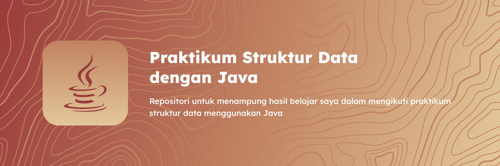

## Struktur Data
**Struktur Data** merupakan salah satu mata kuliah wajib yang ada di kampus saya dan dalam mata kuliah ini mahasiswa akan belajar bagaimana untuk mengolah data.

### Bahasa Pemrograman
Bahasa pemrograman **Java** merupakan bahasa pemrograman pengantar untuk beberapa mata kuliah seperti **pemrograman dasar**, **pemrograman lanjut**, **struktur data** dan **pemrograman berbasis objek**.

### Tools
Untuk mengerjakan praktikum struktur data, saya menggunakan **Visual Studio Code** sebagai Text Editor utama dan ekstensi **Extension Pack for Java**