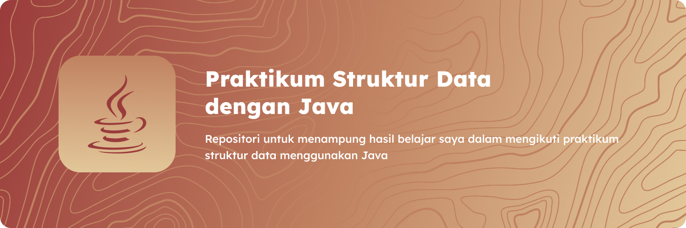

## Struktur Data
**Struktur Data** merupakan salah satu mata kuliah wajib yang disediakan oleh kampus saya dan dalam mata kuliah ini mahasiswa akan belajar bagaimana untuk mengolah data dalam berbagai bentuk struktural sesuai dengan fungsi dan tujuan data tersebut untuk digunakan.

### Bahasa Pemrograman
Bahasa pemrograman **Java** merupakan bahasa pemrograman pengantar untuk beberapa mata kuliah seperti **pemrograman dasar**, **pemrograman lanjut**, **struktur data** dan **pemrograman berbasis objek**.

### Bagian - bagian
Dalam praktikum struktur data yang saya ikuti, terdapat _module_ yang dibagi menjadi beberapa bagian.
- Tipe data dalam bahasa pemrograman Java
- Struktur data Array of Records dan operasinya
    - Penambahan (create/input)
    - Penghapusan (delete)
    - Pencarian (searching)
    - Pengubahan (update)
    - Pemindahan (swapping)
    - Pengurutan (sorting)

### Tools
Untuk mengerjakan praktikum struktur data, saya menggunakan **Visual Studio Code** sebagai Text Editor utama dan ekstensi **Extension Pack for Java**